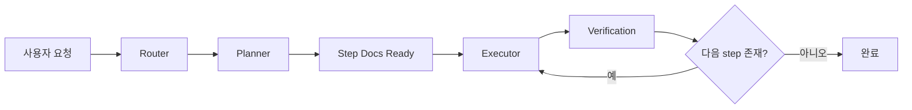
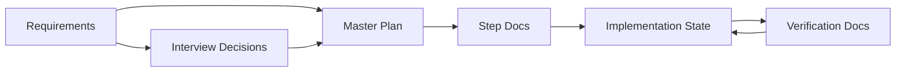

# 셀프 하네스

`self-harness`는 문서 상태와 skill을 기반으로 작업을 운영하는 단일 하네스입니다.

이 저장소의 목적은 모델이 그럴듯하게 답하도록 만드는 것이 아니라, 작업이 정해진 흐름 안에서 안전하게 이어지도록 만드는 것입니다.

- 현재 상태를 문서에서 읽고
- 다음에 누가 어떤 일을 해야 하는지 정하고
- 그 역할에 맞는 skill만 수행하고
- 결과와 증거를 다시 문서로 남깁니다

## 한눈에 보기

이 하네스는 아래 층으로 움직입니다.

- `prompt`
  - 이번 턴의 방향을 줍니다
- `skills`
  - 각 역할의 행동 규칙을 정합니다
- `documents`
  - 현재 상태를 저장하고 복원합니다
- `memory`
  - 다음 세션과 다음 프로젝트에도 계속 참고할 장기 규칙을 저장합니다
- `hooks`
  - 특정 이벤트에서 다음 skill이 자동으로 이어지게 만듭니다

짧게 말하면:

- prompt는 방향
- skills는 행동 규칙
- documents는 상태
- memory는 장기 기억
- hooks는 자동 전이

## 전체 루프

기본 흐름은 아래와 같습니다.

1. 사용자 요청이 들어옵니다
2. router가 요청과 현재 문서 상태를 함께 읽습니다
3. planner, executor, verifier 중 다음 owner를 고릅니다
4. 해당 owner가 문서와 산출물을 갱신합니다
5. 갱신된 상태를 기준으로 다음 단계로 이동합니다

## 역할

### 라우터

router는 다음에 누가 일해야 하는지 정하는 상위 제어층입니다.

직접 일을 하지 않고, `prompt + state`를 함께 보고 다음 skill을 고릅니다.

### 플래너

planner는 이미 있는 요구사항을 읽고, 이를 구현 가능한 계획으로 바꾸는 역할입니다.

주요 책임:

- 요구사항이 충분한지 판단
- 기술 방향을 먼저 고정
- 부족하면 사용자에게 질문
- 확정된 결정을 기록
- master plan 생성
- step docs 생성

기본 규칙:

- 제품 범위를 바꿔야 하면 멈춤
- 승인 없는 확정 금지
- acceptance를 쓸 근거가 부족하면 멈춤
- 충분하면 다음 단계로 진행

### 실행기

executor는 현재 활성 step 하나만 구현합니다.

주요 책임:

- 현재 step 범위 안에서만 구현
- 다음 step 선구현 금지
- 범위 확장 금지
- `verification-ready` 상태까지 만들기

기본 규칙:

- blocker가 없으면 자동 진행
- 완료 선언은 하지 않음

### 검증기

verifier는 현재 step이 정말 끝났는지 증거로 판정합니다.

주요 책임:

- acceptance 기준 확인
- 각 기준에 대한 증거 수집
- `pass / fail / blocked` 판정
- verification 문서 작성
- `completed` 상태 닫기

기본 규칙:

- acceptance 없으면 완료 금지
- 증거 없으면 pass 금지
- verification 문서 없으면 completed 금지

### 차단 이슈 처리

blocker handler는 막힘의 성격을 분류합니다.

- executor가 계속 해결할 수 있는지
- planner가 다시 판단해야 하는지
- 사용자 승인까지 올라가야 하는지

를 먼저 정합니다.

## 문서 우선 원칙

`docs-first`는 작업 단계가 아니라 운영 원칙입니다.

이 하네스는 대화 기억만 믿지 않고, `docs/` 아래 상태 문서를 source of truth로 사용합니다.

즉 세션이 바뀌어도 문서를 읽으면 현재 위치를 복원할 수 있어야 합니다.

## 상태 문서

### 요구사항

- 목적: 사람이 작성한 원본 요구사항
- 위치: `docs/requirements/*.md`
- 규칙: AI가 원본 파일을 덮어쓰거나 풍부화하지 않음

### 인터뷰 결정

- 목적: 개발 인터뷰를 통해 확정된 결정 기록
- 위치: `docs/interview/development-interview-decisions.md`
- 규칙: `confirmed`는 명시적 승인 기반으로만 기록

### 기술 접근 방식

- 목적: 계획 전에 필요한 기술 방향과 선택 근거를 고정
- 위치: `docs/architecture/technical-approach.md`
- 규칙: 추천은 가능하지만 최종 선택은 명시적 승인 후에만 `confirmed`로 기록

### 마스터 플랜

- 목적: 확정된 결정을 바탕으로 만든 전체 구현 계획
- 위치: `docs/plans/master-plan.md`
- 규칙: 인터뷰 종료 후에만 생성

### 스텝 문서

- 목적: 실제 실행 단위인 step 정의
- 위치: `docs/plans/steps/*.md`
- 규칙: in-scope, out-of-scope, outputs, acceptance 포함

### 구현 상태

- 목적: 현재 어떤 step이 활성화되어 있고 다음 허용 행동이 무엇인지 기록
- 위치: `docs/implementation/implementation-state.md`
- 규칙: 동시에 active step은 하나만 존재하며, 상태값은 고정값만 사용

### 검증 문서

- 목적: step 완료 여부를 증거 기반으로 남기는 문서
- 위치: `docs/verification/step-xx-verification.md`
- 규칙: step마다 검증 문서 하나가 있어야 하며, verification 문서 없이는 completed 금지

### 상태값 계약

`implementation-state.md`는 상태판이고, 검증 문서를 대신하지 않습니다.

- `Current Status`는 아래 고정값만 사용합니다
  - `in_progress`
  - `verification-ready`
  - `blocked`
  - `done`
- `Step Status` 표의 `Status`는 아래 고정값만 사용합니다
  - `pending`
  - `in_progress`
  - `completed`
  - `blocked`
- `Verification Doc` 열에는 상태값이 아니라 실제 파일명만 적습니다
  - 예: `step-03-verification.md`
- `Last Verification Result`에는 요약만 남기고, 상세 증거는 step별 verification 문서에 남깁니다
- `Blockers`는 blocker가 없으면 반드시 정확히 `- None`으로 적습니다

문서 관계는 아래와 같습니다.

## 메모리

memory는 현재 프로젝트의 일시적 상태가 아니라, 컨텍스트 압축이나 새 세션이 와도 다시 참고해야 하는 장기 기억을 저장하는 레이어입니다.

즉 차이는 아래와 같습니다.

- `docs`
  - 현재 작업 상태
  - 지금 어떤 step이 활성화되어 있는지, 무엇이 검증되었는지
- `memory`
  - 다음에도 다시 묻기 아까운 안정된 규칙
  - 사용자 선호, 하네스 운영 규칙, 반복 blocker 패턴

현재 memory는 아래 두 파일로 시작합니다.

- `memory/harness-memory.md`
  - 하네스 공통 운영 규칙과 안정된 선호
- `memory/project-memory.md`
  - 현재 프로젝트에서 반복적으로 확인된 기술 선택, 컨벤션, blocker 패턴

원칙:

- 한 번 나온 추측은 저장하지 않음
- `confirmed`이거나 반복된 내용만 저장
- 현재 step의 일시적 상태는 `docs`에 두고, 장기적으로 재사용할 내용만 `memory`에 둠

## 누가 어떤 문서를 읽는가

### 사람이 주로 읽는 문서

- `README.md`
- `docs/requirements/README.md`
- `templates/product-requirements-template.md`

### AI가 주로 읽는 문서

- `START.md`
- `skills/*/SKILL.md`
- `memory/*`
- `hooks/*`
- `docs/state-model.md`
- `docs/document-lifecycle.md`

### 사람과 AI가 같이 보는 문서

- `docs/requirements/`
- `docs/interview/`
- `docs/plans/`
- `docs/implementation/`
- `docs/verification/`
- `memory/`
- `templates/`

## 스킬 구성

### 라우팅

- `route-self-harness`

### 요구사항

- `author-product-requirements`

### 플래너

- `assess-product-requirements`
- `select-technical-approach`
- `conduct-development-interview`
- `generate-master-plan`
- `generate-step-docs`

### 실행

- `implementation-start`
- `implement-current-step`
- `implementation-blocker`

### 검증

- `verify-current-step`

### 회고

- `project-retrospective`

## 훅 구성

hook은 새로운 역할이 아닙니다.

hook은 이미 있는 skill들을 특정 이벤트에서 자동으로 이어주는 연결층입니다.

현재 구조는 두 부분으로 나뉩니다.

- `hooks/`
  - Claude Code가 실제로 실행하는 runtime hook 스크립트
- `.claude/settings.json`
  - Claude Code 이벤트를 runtime hook에 연결하는 wiring

현재 들어 있는 runtime hook은 아래 3개입니다.

- `session-start`
  - 새 세션 시작 시 현재 상태와 memory를 읽고 복원 컨텍스트를 주입
- `user-prompt-submit`
  - 사용자 입력 전 `prompt + state + memory` 라우팅을 강제
- `stop-guard`
  - 검증 전 종료, blocked 방치, 다음 step 미활성화를 막음

추가 규칙:

- blocked가 기록되면 hook은 다음 assistant 응답이 반드시 사용자 질문이 되도록 유도합니다
- 이때 질문은 여러 개가 아니라 정확히 하나의 unblock 질문이어야 합니다

즉 하네스의 기본 루프는 그대로 두고, hook이 “다음 행동을 누가 시작할지”를 일부 자동으로 맡습니다.

## 현재 운영 규칙

### Planner

- 제품 범위를 추가해야 하면 멈춤
- 승인 없는 확정 금지
- acceptance를 쓸 근거가 부족하면 멈춤
- 그 외에는 다음 단계로 진행

### Executor

- 활성 step만 구현
- 미래 step 선구현 금지
- 범위 확장 금지
- `verification-ready`까지만 책임짐

### Verifier

- acceptance 없으면 완료 금지
- 증거 없으면 pass 금지
- verification 문서 없으면 completed 금지
- step별 verification 문서 없이 implementation-state만 갱신하는 것 금지

## 폴더 구조

- `START.md`
  - 하네스의 최상위 운영 계약
- `docs/`
  - 실제 상태 문서가 쌓이는 곳
- `memory/`
  - 장기적으로 재사용할 운영 기억
- `skills/`
  - router, planner, executor, verifier, blocker의 행동 규칙
- `hooks/`
  - 이벤트 기반 runtime hook 스크립트
- `.claude/`
  - Claude Code 프로젝트 hook 설정
- `templates/`
  - 문서 작성 형식
- `experiments/`
  - 하네스로 실제 수행한 프로젝트 산출물 보관

## 하위 디렉터리 설명

### docs

- `docs/requirements/`
  - 실제 사람이 넣는 요구사항 문서
- `docs/interview/`
  - 인터뷰에서 확정된 결정
- `docs/architecture/`
  - 계획 전에 고정한 기술 방향과 선택 근거
- `docs/plans/`
  - master plan과 step docs
- `docs/implementation/`
  - 현재 실행 상태
- `docs/verification/`
  - 검증 증거 문서

### memory

- `memory/harness-memory.md`
  - 하네스 공통 운영 규칙과 안정된 선호
- `memory/project-memory.md`
  - 현재 프로젝트에서 반복적으로 확인된 기술 규칙, 결정, blocker 패턴

### skills

- planning, execution, verification, routing 역할별 `SKILL.md` 보관

### hooks

- 실제 Claude Code hook 스크립트 보관
- 현재는 PowerShell 기반 runtime hook 사용

### .claude

- 프로젝트 단위 Claude Code 설정 보관
- 현재는 `settings.json`으로 hook wiring만 담당

### templates

- live 상태 문서가 아니라 문서 형식을 정하는 기본 틀

### experiments

- 이 하네스로 실제로 수행한 결과물 보관
- 하네스 자체와 개별 프로젝트 산출물을 분리하기 위한 공간

## 템플릿

템플릿은 live 상태가 아니라 문서 형식을 정하는 기본 양식입니다.

포함 대상:

- requirements
- interview decisions
- master plan
- step docs
- implementation state
- verification docs
