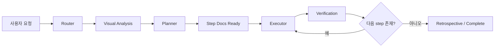

# 하네스

이 저장소는 문서 상태와 skill을 기준으로 작업을 운영하는 단일 하네스입니다.

핵심 목적은 모델이 무작정 구현으로 뛰지 않고, 현재 상태를 읽고 다음 owner를 고른 뒤, 그 결과를 다시 문서에 남기게 만드는 것입니다.

## 큰 흐름

하네스는 아래 순서로 움직입니다.

1. 사용자 요청을 받습니다.
2. router가 `prompt + state`를 함께 해석합니다.
3. 입력이 PDF, 프로토타입, 와이어프레임 같은 시각 자료라면 먼저 `visual analysis`를 만듭니다.
4. planner가 requirements, technical approach, plan, step docs를 만듭니다.
5. executor가 현재 step만 구현합니다.
6. verifier가 증거로 step 완료 여부를 닫습니다.
7. retrospective와 transition으로 다음 프로젝트를 준비합니다.

## 역할

### Router

router는 직접 일하지 않습니다. 현재 문서 상태와 사용자 입력을 보고 다음 skill을 고릅니다.

### Visual Analysis

PDF, 이미지, 프로토타입처럼 시각 자료가 source of truth일 때 먼저 화면 inventory를 만듭니다.

이 단계의 목적은:

- 보이는 화면 수를 먼저 고정하고
- 숨김, 이동, 링크, 텍스트 변경 지시를 기록하고
- 제외 화면이 있다면 이유를 남기고
- 애매하면 질문 1회로 멈추는 것

즉, 시각 자료를 곧바로 requirements로 바꾸지 않고 한 번 분석 문서로 고정합니다.

### Planner

planner는 요구사항과 결정을 구조화합니다.

주요 책임:

- requirements 평가
- technical approach 확정
- 개발 인터뷰 진행
- master plan 작성
- step docs 작성

### Executor

executor는 현재 active step만 구현합니다.

주요 규칙:

- 범위 확장 금지
- 다음 step 선구현 금지
- 완료 선언 금지
- `verification-ready`까지만 책임

### Verifier

verifier는 acceptance와 증거를 기준으로 완료를 닫습니다.

주요 규칙:

- acceptance 없으면 완료 금지
- 증거 없으면 pass 금지
- step별 verification 문서 없으면 completed 금지

## docs-first

이 하네스는 `docs-first`를 운영 원칙으로 사용합니다.

즉 대화만 믿지 않고, `docs/` 아래 상태 문서를 source of truth로 사용합니다.

세션이 바뀌어도 문서를 읽으면 현재 위치를 복원할 수 있어야 합니다.

## 상태 문서

### Requirements

- 위치: `docs/requirements/`
- 역할: 사람이 쓴 요구사항 원본

### Visual Analysis

- 위치: `docs/visual-analysis/`
- 역할: PDF, 프로토타입, 이미지 입력을 requirements 이전에 화면 inventory로 정리한 문서

### Architecture

- 위치: `docs/architecture/`
- 역할: planning 전에 고정한 technical approach

### Interview

- 위치: `docs/interview/`
- 역할: planner가 확정한 개발 인터뷰 결정

### Plans

- 위치: `docs/plans/`
- 역할: planning-state, master plan, step docs

### Implementation

- 위치: `docs/implementation/`
- 역할: 현재 active step과 next action을 기록하는 상태판

### Verification

- 위치: `docs/verification/`
- 역할: step별 증거 문서

## Memory

`memory/`는 현재 step 상태가 아니라 장기적으로 재사용할 운영 기억을 담습니다.

- `memory/harness-memory.md`
  - 하네스 공통 규칙과 반복 선호
- `memory/project-memory.md`
  - 현재 프로젝트에서 반복적으로 참고할 기술 선택, 규칙, blocker 패턴

## Hooks

`hooks/`는 runtime hook 스크립트입니다.

현재 목적은:

- 세션 시작 시 상태 복원
- 사용자 입력을 state-aware 하게 해석
- 너무 이른 종료 방지

`.claude/settings.json`은 Claude Code 이벤트를 이 hook들에 연결하는 wiring만 담당합니다.

## 주요 skill

### 입력과 planning

- `analyze-visual-source`
- `author-product-requirements`
- `assess-product-requirements`
- `select-technical-approach`
- `conduct-development-interview`
- `generate-master-plan`
- `generate-step-docs`

### 실행과 검증

- `implementation-start`
- `implement-current-step`
- `verify-current-step`
- `implementation-blocker`

### 운영

- `route-self-harness`
- `project-retrospective`
- `project-transition`

## 템플릿

`templates/`는 live 문서가 아니라, 문서가 어떤 형식으로 작성되어야 하는지 정하는 기본 양식입니다.

지금 포함된 템플릿:

- product requirements
- visual source analysis
- technical approach
- interview decisions
- planning state
- master plan
- step docs
- implementation state
- step verification

## 디렉터리 구조

- `CLAUDE.md`
  - 최상위 운영 계약
- `docs/`
  - live 상태 문서
- `hooks/`
  - runtime hook 스크립트
- `memory/`
  - 장기 기억
- `skills/`
  - 역할별 운영 규칙
- `templates/`
  - 문서 양식
- `experiments/`
  - 하네스로 실제 수행한 결과물 보관 공간
