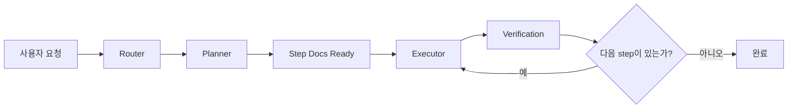
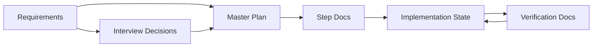

# self-harness

`self-harness`는 문서 상태와 skill을 중심으로 소프트웨어 작업을 운영하기 위한 단일 하네스입니다.

이 하네스의 목표는 모델이 그럴듯하게 답하게 만드는 것이 아니라, 작업이 정해진 흐름 안에서 안전하게 진행되도록 만드는 것입니다.

- 현재 상태를 문서에서 읽고
- 다음에 누가 어떤 일을 해야 하는지 정하고
- 그 역할에 허용된 일만 수행하고
- 결과와 증거를 다시 문서에 남깁니다

## 핵심 개념

이 하네스는 세 가지 층으로 움직입니다.

- `prompt`
  - 이번 턴에서 어디로 가야 하는지 방향을 줍니다
- `skills`
  - 어떤 방식으로 행동할지, 어디서 멈출지, 어디까지 진행할지를 정합니다
- `documents`
  - 대화 바깥에 실제 상태를 저장합니다

짧게 말하면:

- prompt는 방향
- skills는 행동 규칙
- documents는 상태

## 전체 루프

실행 흐름은 기본적으로 아래 순서로 움직입니다.

1. 사용자 요청이 들어옵니다
2. router가 요청과 현재 문서 상태를 함께 봅니다
3. 지금 필요한 역할로 요청을 보냅니다
4. 해당 역할이 문서나 코드를 갱신합니다
5. 갱신된 상태를 기준으로 다음 단계를 이어갑니다

대표적인 흐름은 아래와 같습니다.

## 역할

### Router

router는 다음에 누가 일해야 하는지를 정하는 상위 제어층입니다.

직접 일을 하지는 않고, `prompt + state`를 함께 보고 다음 skill을 고릅니다.

### Planner

planner는 이미 존재하는 요구사항을 읽고, 그것을 구현 가능한 계획으로 바꾸는 역할입니다.

주요 책임:

- 요구사항이 충분한지 판단
- 부족하면 사용자에게 질문
- 확정된 결정을 기록
- master plan 생성
- step docs 생성

기본 규칙:

- 제품 범위를 추측해야 하면 멈춤
- 명시적 승인 없이 확정하지 않음
- 계획 근거가 충분하면 다음 단계로 진행

### Executor

executor는 현재 활성화된 step 하나만 구현합니다.

주요 책임:

- 현재 step 범위 안에서만 구현
- 다음 step 선구현 금지
- 범위를 조용히 넓히지 않기
- `verification-ready` 상태까지만 만들기

기본 규칙:

- blocker가 없으면 자동 진행
- 완료 선언은 하지 않음

### Verifier

verifier는 현재 step이 정말 끝났는지 판정합니다.

구현이 얼추 된 것처럼 보인다고 완료가 되는 것이 아니라, 미리 정한 acceptance 기준을 실제 증거로 통과해야만 완료로 닫을 수 있습니다.

검증 결과는 다음 셋 중 하나입니다.

- `pass`
- `fail`
- `blocked`

### Blocker Handling

작업이 더 이상 안전하게 진행되지 않을 때는 blocker handler가 문제의 성격을 분류합니다.

- executor가 해결 가능한 구현 문제인지
- planner가 다시 판단해야 하는지
- 사용자 확인이 필요한지

## Docs-First 원칙

`docs-first`는 작업 단계가 아니라 운영 원칙입니다.

즉, 이 하네스는 대화 기억에 의존하지 않고 외부 문서를 상태 저장소로 삼습니다. 세션이 바뀌어도 `docs/` 아래 문서를 읽으면 현재 상태를 복원할 수 있어야 합니다.

## 상태 문서

하네스가 실제로 참고하는 핵심 문서는 아래와 같습니다.

### Requirements

- 목적: 사람이 작성한 원본 요구사항
- 위치: `docs/requirements/*.md`
- 규칙: AI가 원본 파일을 덮어쓰면 안 됨

### Interview Decisions

- 목적: 개발 인터뷰를 통해 확정된 결정 기록
- 위치: `docs/interview/development-interview-decisions.md`
- 규칙: `confirmed`는 명시적 답변이나 승인만 사용

### Master Plan

- 목적: 확정된 결정을 기반으로 만든 전체 구현 계획
- 위치: `docs/plans/master-plan.md`
- 규칙: 인터뷰 이후에만 생성

### Step Docs

- 목적: 실제 실행 단위가 되는 step 문서
- 위치: `docs/plans/steps/*.md`
- 규칙: in-scope, out-of-scope, outputs, acceptance를 반드시 포함

### Implementation State

- 목적: 현재 어떤 step이 활성화되어 있고 다음 허용 행동이 무엇인지 기록
- 위치: `docs/implementation/implementation-state.md`
- 규칙: 동시에 활성 step은 하나만 존재

### Verification Docs

- 목적: step 완료 여부를 증거 기반으로 남기는 문서
- 위치: `docs/verification/step-xx-verification.md`
- 규칙: verification 문서 없이는 completed 금지

문서 간 관계는 아래와 같습니다.

## 누가 주로 읽는 문서인가

### 사람이 주로 읽는 문서

- `README.md`
- `docs/requirements/README.md`
- `templates/product-requirements-template.md`

### AI가 주로 읽는 문서

- `START.md`
- `skills/*/SKILL.md`
- `docs/state-model.md`
- `docs/document-lifecycle.md`

### 사람과 AI가 함께 보는 문서

- `docs/requirements/`, `docs/interview/`, `docs/plans/`, `docs/implementation/`, `docs/verification/` 아래 실제 상태 문서
- `templates/` 아래 템플릿 문서

## Skill 구성

### Routing

- `route-self-harness`

### Planner

- `assess-product-requirements`
- `conduct-development-interview`
- `generate-master-plan`
- `generate-step-docs`

### Execution

- `implementation-start`
- `implement-current-step`
- `implementation-blocker`

### Verification

- `verify-current-step`

## 현재 운영 규칙

### Planner

- 제품 범위를 추측해야 하면 멈춤
- 승인 없는 확정 금지
- acceptance를 쓸 근거가 부족하면 멈춤
- 그 외에는 다음 단계로 진행

### Executor

- 활성 step만 구현
- 미래 step 선구현 금지
- 범위 확장 금지
- `verification-ready`까지만 책임짐

### Verifier

- acceptance 없으면 완료 금지
- 증거 없으면 pass 금지
- verification 문서 없으면 completed 금지

## 폴더 구조

- `START.md`
  - 하네스의 최상위 운영 계약
- `docs/`
  - 실제 상태 문서가 쌓이는 곳
- `skills/`
  - router, planner, executor, verifier, blocker의 행동 규칙
- `templates/`
  - 문서 표준 양식

## 하위 디렉터리 설명

- `docs/requirements/`
  - 실제 사람이 넣는 요구사항 문서
- `docs/interview/`
  - 인터뷰에서 확정된 결정
- `docs/plans/`
  - master plan과 step docs
- `docs/implementation/`
  - 현재 실행 상태
- `docs/verification/`
  - 검증 근거 문서

## Templates

템플릿은 live 상태가 아니라 문서 형식을 정하는 기본 틀입니다.

포함 대상:

- requirements
- interview decisions
- master plan
- step docs
- implementation state
- verification docs
