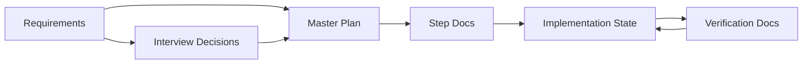

# Document Lifecycle

This file explains when each state document is created, updated, and read.

## 1. Requirements

- Created by: human, or by a dedicated requirements-authoring flow before planning starts
- Read by: planner
- Updated by: human only
- Rule: AI must not overwrite or silently enrich the original requirements file

## 2. Interview Decisions

- Created by: planner during the development interview
- Read by: planner, router, executor when needed
- Updated by: planner only
- Rule: use `confirmed` only for explicit user answers or approvals

## 3. Master Plan

- Created by: planner after interview exit criteria are satisfied
- Read by: router, executor
- Updated by: planner only
- Rule: must reflect confirmed decisions, not guessed scope

## 4. Step Docs

- Created by: planner after the master plan exists
- Read by: executor, verifier
- Updated by: planner, or by plan revision flow if step boundaries must change
- Rule: each step must define scope, outputs, and acceptance

## 5. Implementation State

- Created by: implementation-start when execution begins
- Read by: router, executor, verifier
- Updated by: executor and verifier
- Rule: exactly one active step at a time unless the project is fully complete

## 6. Verification Docs

- Created by: verifier for each step
- Read by: router, executor, human reviewers
- Updated by: verifier only
- Rule: no completed state without evidence in a verification document

## Lifecycle Summary

## Operational Meaning

- Requirements and interview documents define intent and confirmed decisions
- Plans define execution structure
- Implementation state defines the current location
- Verification docs define what has actually been proven
